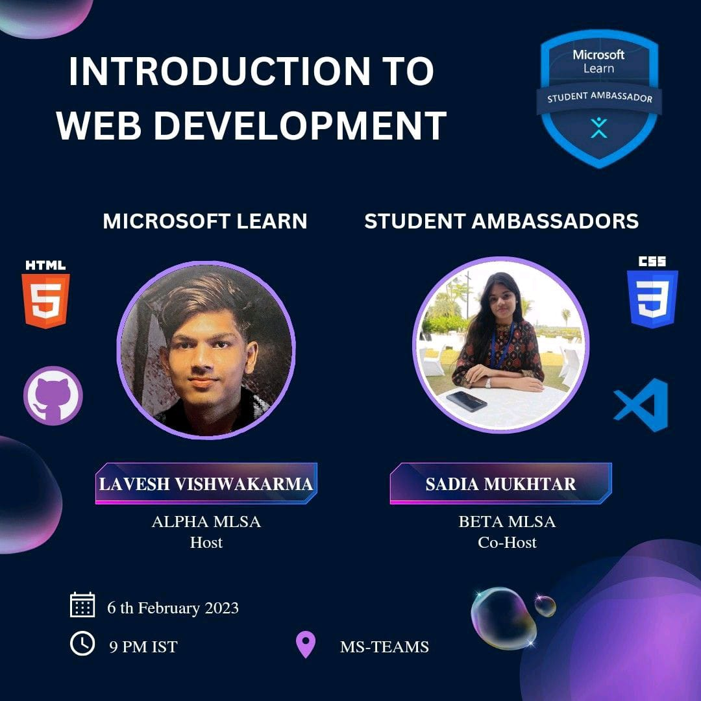
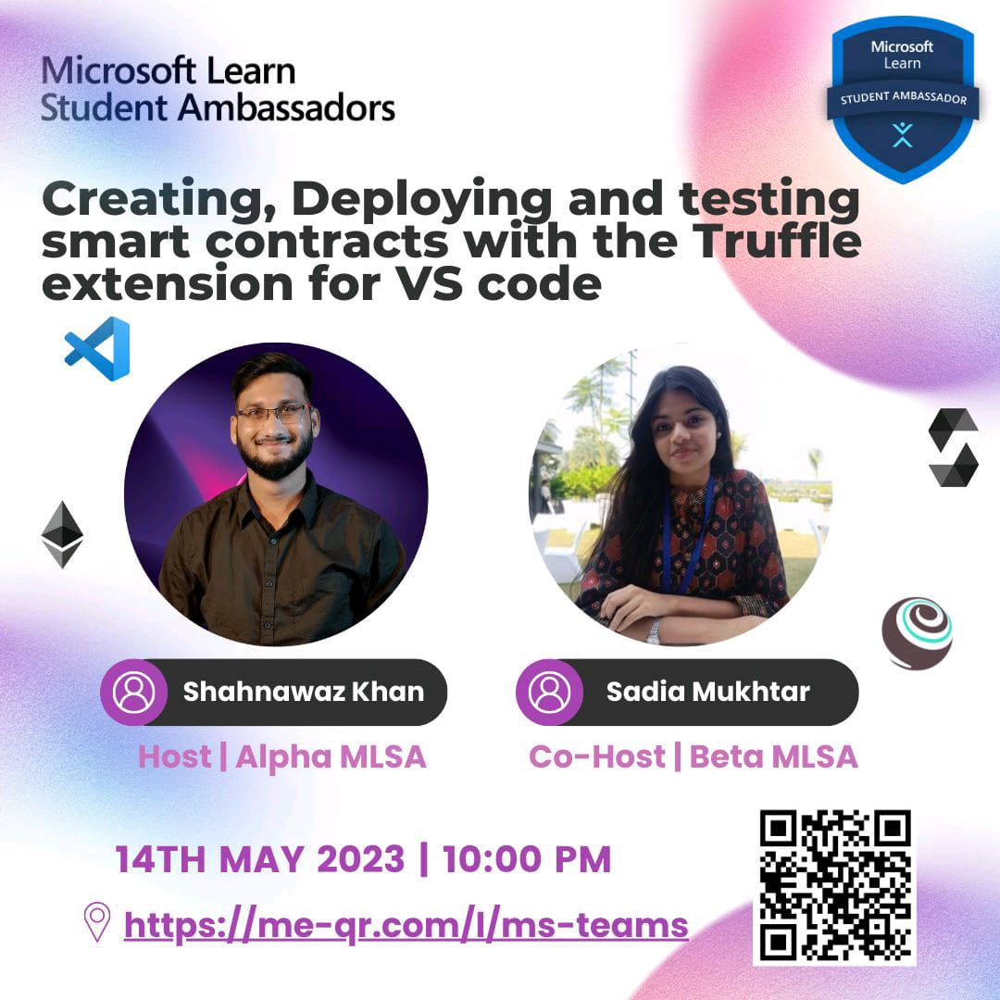

# MY EVENTS
---

Step into my world of events! Here, I've gathered the amazing experiences I've created. From planning to reality, each event is a journey of passion and dedication. Let's explore together – get inspired, believe in your dreams, and see how incredible moments come to life.

---

## Events

Meet an enthusiastic and dedicated individual who thrives as both a passionate speaker and a community advocate. With a strong commitment to sharing knowledge, I have led engaging sessions on a diverse range of technologies.

1. *Demystifying GitHub and Codespaces*
    
     
   
    
2. *Getting Involved With Communities*
 
     
   

3. *Introduction to GitHub and GitHub copilot*
    

     
   

4. *Introduction to Web Development*
    
  
     
   

5. *Creating deploying and testing smart contracts with Truffle extension for VS code*
    
     
   

6. *Introduction to Azure and AI*
    
     
   

7. *Build A simple website to showcase your Resume*
    
     
   

9. *Create a Website to showcase your resume*
    
     
   

---

## Events

Here are a few of the Twitter Spaces that I've hosted thus far.

* Title - Beyond the Screen- Why you must attend in person events?
    
    Link - [https://twitter.com/hackforcode/status/1634906823399718913?t=1vEYY2pPJeimafbmilqctg&s=19](https://twitter.com/hackforcode/status/1634906823399718913?t=1vEYY2pPJeimafbmilqctg&s=19)
    
* Title - Public Speaking? An Art-
    
    Link - [https://twitter.com/hackforcode/status/1634769642228178946?t=fYsPfNMjpl3lPrRnNbKuCA&s=19](https://twitter.com/hackforcode/status/1634769642228178946?t=fYsPfNMjpl3lPrRnNbKuCA&s=19)
    
* Title - Innovate, Create, Hack: Know All About the Hackathons
    
    Link - [https://twitter.com/hackforcode/status/1626580979661012993?t=1jkdYNJxs7W-oyY9jToucA&s=19](https://twitter.com/hackforcode/status/1626580979661012993?t=1jkdYNJxs7W-oyY9jToucA&s=19)
    
* Title - Tips and Tricks to manage Dev and DSA
    
    Link - [https://twitter.com/hackforcode/status/1624738456294539266?t=L2\_KC8BIDfHCYybrIVKbtg&s=19](https://twitter.com/hackforcode/status/1624738456294539266?t=L2_KC8BIDfHCYybrIVKbtg&s=19)
    
* Title - Open Source Opportunities
    
    Link - [https://twitter.com/hackforcode/status/1624738456294539266?t=L2\_KC8BIDfHCYybrIVKbtg&s=19](https://twitter.com/hackforcode/status/1624738456294539266?t=L2_KC8BIDfHCYybrIVKbtg&s=19)
    
* Title - Networking in Tech
    
    Link - [https://twitter.com/hackforcode/status/1622210976933363716?t=NhA1F5n\_iZbYeZcXcvdE7Q&s=19](https://twitter.com/hackforcode/status/1622210976933363716?t=NhA1F5n_iZbYeZcXcvdE7Q&s=19)
    
* Title - The power of learning in public
    
    Link- [https://twitter.com/hackforcode/status/1616793360236445697?t=V9F-sbcUYQki07\_ipKUj\_A&s=19](https://twitter.com/hackforcode/status/1616793360236445697?t=V9F-sbcUYQki07_ipKUj_A&s=19)
